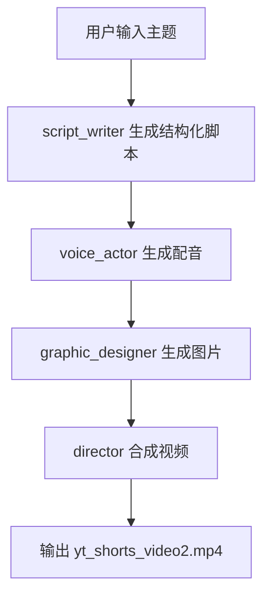

# AutoGen Short Video Generator

基于 AutoGen 多智能体工作流的短视频自动生成项目。输入一个主题后，系统会按顺序生成：

1. 脚本与字幕
2. 配音
3. 图片
4. 合成视频（带字幕与背景音乐）

默认输出文件为 `yt_shorts_video2.mp4`。

## 工作流



## 项目结构

```text
autogen_generate_video/
├── main.py                 # 多智能体入口
├── tools.py                # 语音/图片/视频工具函数
├── requirements.txt        # Python 依赖（UTF-16 LE 编码）
├── music/                  # 背景音乐目录
├── images/                 # 图片输出目录
├── voiceovers/             # 配音输出目录
├── autogen_study/          # AutoGen 学习示例
└── README.md
```

## 运行环境

- Python 3.10+
- FFmpeg（必须在 PATH 中可执行）
- 可访问以下外部服务：
  - DashScope 兼容 OpenAI 接口（脚本与翻译）
  - 豆包 TTS（配音）
  - Pollinations 图像接口（出图）

## 安装

```bash
python -m venv .venv
source .venv/bin/activate   # Windows: .venv\Scripts\activate
pip install -r requirements.txt
```

如果 `pip install -r requirements.txt` 因编码失败（该文件当前是 UTF-16 LE），可先转成 UTF-8：

```bash
iconv -f UTF-16LE -t UTF-8 requirements.txt > requirements.utf8.txt
pip install -r requirements.utf8.txt
```

## 环境变量

在项目根目录创建 `.env`：

```env
# DashScope (OpenAI compatible)
DASHSCOPE_API_KEY=your_dashscope_api_key
API_BASE_URL=https://dashscope.aliyuncs.com/compatible-mode/v1

# Doubao TTS
DOUBAO_APPID=your_doubao_appid
DOUBAO_ACCESS_TOKEN=your_doubao_access_token
```

说明：

- `tools.py` 中豆包变量名是 `DOUBAO_APPID` 和 `DOUBAO_ACCESS_TOKEN`。
- 旧文档中出现的 `APPID` / `ACCESS_TOKEN` 与代码不一致，请以本 README 为准。

## 使用方式

```bash
python main.py
```

运行后输入主题，例如：

```text
如何在 60 秒内解释黑洞蒸发
```

生成结果：

- `images/image_*.jpg`
- `voiceovers/voiceover_*.mp3`
- `yt_shorts_video2.mp4`

## 我对项目的审视结论

以下是当前版本最关键的风险点（建议优先处理）：

1. 图像接口鉴权问题  
   `tools.py` 当前写死了一个 Pollinations token。实测接口会返回 `401 UNAUTHORIZED` 时，图片不会生成。

2. 图像失败不会中断流程  
   `generate_images` 在失败时仅打印错误，不抛出异常，后续视频阶段可能出现“素材数量不匹配”或空目录问题。

3. 文档和代码曾不一致  
   环境变量命名存在历史偏差（`APPID` vs `DOUBAO_APPID`），已在本 README 修正。

## 故障排查

### 1) 图片目录为空

- 先看运行日志是否出现 `HTTP状态码 401` 或网络错误。
- 检查是否能访问 `https://gen.pollinations.ai`。
- 确认你使用的是可用 API key（当前代码是硬编码方式）。

### 2) 报 `ffmpeg: command not found`

- macOS: `brew install ffmpeg`
- Ubuntu/Debian: `sudo apt-get install ffmpeg`
- Windows: 安装 FFmpeg 并加入 PATH

### 3) 字体显示异常

项目默认使用 `SimHei.ttf`/系统中文字体。若 drawtext 报错，请在 `tools.py` 中调整 `fontfile` 为本机有效路径。

## 后续改进建议

- 将 Pollinations API key 改为环境变量（避免硬编码）。
- 图片生成失败时抛异常并停止工作流。
- 为语音/图片/视频步骤补充最小化集成测试。

