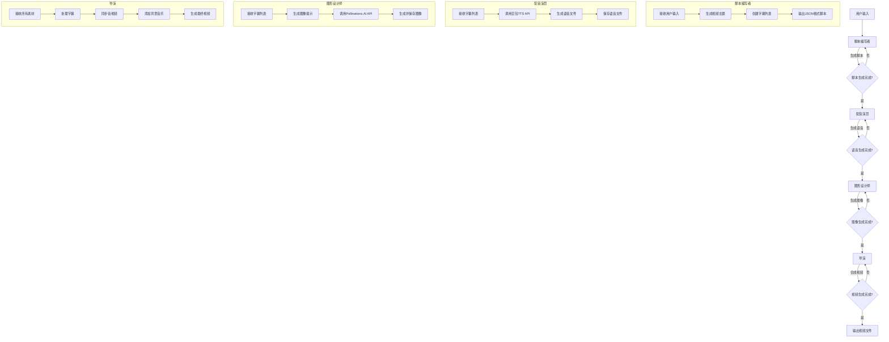

# AutoGen 短视频生成系统

这是一个基于AutoGen多智能体系统的自动化短视频生成工具。该系统能够自动生成包含图像、语音和字幕的短视频，特别适合制作YouTube Shorts风格的短视频内容。

## 系统流程图




## 功能特点

- 🤖 多智能体协作：使用多个专门的AI智能体协同工作
- 📝 自动脚本生成：根据用户输入自动生成视频脚本
- 🎨 AI图像生成：自动为每个场景生成匹配的图像
- 🗣️ 语音合成：自动生成专业的画外音
- 🎬 视频合成：自动将图像、语音和字幕合成为完整的视频
- 🎵 背景音乐：支持添加背景音乐增强视频效果

## 系统架构

系统由以下四个主要智能体组成：

1. **脚本编写者 (Script Writer)**
   - 负责生成视频脚本
   - 创建引人入胜的字幕
   - 确保内容的连贯性和吸引力

2. **配音演员 (Voice Actor)**
   - 负责生成画外音
   - 使用豆包TTS API生成自然流畅的语音

3. **图形设计师 (Graphic Designer)**
   - 负责生成视频所需的图像
   - 使用Pollinations.AI API创建高质量图像
   - 确保图像与字幕内容相匹配

4. **导演 (Director)**
   - 负责最终的视频合成
   - 协调图像、语音和字幕的同步
   - 添加背景音乐和特效

## 安装说明
1.安装依赖：

```bash
pip install -r requirements.txt
```

2. 配置环境变量：
创建 `.env` 文件并添加以下配置：
但是如果相关变量已在系统环境变量中配置，则相关变量可以不用配置。
```
DASHSCOPE_API_KEY=你的API密钥
API_BASE_URL=API基础URL
APPID=豆包TTS的APPID
ACCESS_TOKEN=豆包TTS的访问令牌
```

## 使用方法

1. 运行主程序：
```bash
python main.py
```

2. 在提示符下输入你想要制作视频的主题或内容。

3. 系统会自动：
   - 生成视频脚本
   - 创建匹配的图像
   - 生成画外音
   - 合成最终视频

4. 生成的视频将保存为 `yt_shorts_video2.mp4`

## 目录结构

```
autogen_generate_video/
├── main.py              # 主程序入口
├── tools.py            # 工具函数集合
├── requirements.txt    # 项目依赖
├── music/             # 背景音乐文件夹
├── images/            # 生成的图像存储
├── voiceovers/        # 生成的语音文件存储
├── autogen_study/     # AgentChat核心概念学习代码文件夹
└── README.md          # 项目说明文档

```

## 注意事项

1. 确保有足够的磁盘空间用于存储生成的媒体文件
2. 需要稳定的网络连接以访问各种API服务
3. 视频生成过程可能需要几分钟时间，请耐心等待
4. 建议使用Python 3.8或更高版本

## 依赖项

- autogen-agentchat
- autogen-ext[openai]
- elevenlabs
- python-dotenv
- requests
- numpy
